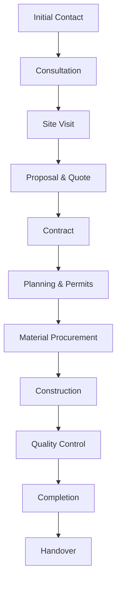

# Project Workflow

Understand the step-by-step process for construction projects with Piedra Angular Construcción.

## Overview

Construction projects at Piedra Angular follow a structured workflow designed to deliver quality results on time and within budget.



## Detailed Workflow

<Steps>
  <Step title="Initial Contact">
    **Goal**: Connect with Piedra Angular and describe your project
    
    **How**: Via WhatsApp or in-person visit
    
    From the website:
    ```html construccion.html:58-62
    <a class="btn btn-primary" href="#contacto">Solicitar presupuesto</a>
    <a class="btn btn-outline" 
       href="https://wa.me/5493812500312" 
       target="_blank">WhatsApp directo</a>
    ```
    
    **What to Share:**
    - Project type (new build, renovation, addition)
    - Location (address or area)
    - Approximate size/scope
    - Timeline goals
    - Budget range (if known)
    
    **Duration**: Initial message exchange within hours during business hours (8:30 AM - 9:00 PM Mon-Fri)
  </Step>

  <Step title="Initial Consultation">
    **Goal**: Discuss project vision, goals, and feasibility
    
    **Format**: In-person meeting at Piedra Angular office or your location
    
    **Topics Covered:**
    - Your vision and requirements
    - Site conditions and challenges
    - Design preferences and inspirations
    - Budget parameters
    - Timeline expectations
    - Regulatory requirements (permits, zoning)
    
    **Team Present:**
    - Project manager or architect
    - Possibly master builder for technical input
    
    **Deliverable**: Understanding of project scope and next steps
    
    **Duration**: 1-2 hours
    
    <Note>
    Bring any existing plans, inspiration photos, or sketches to this meeting. The more information you provide, the more accurate the initial assessment.
    </Note>
  </Step>

  <Step title="Site Visit & Assessment">
    **Goal**: Evaluate physical conditions and constraints
    
    **Activities:**
    - Site measurements and survey
    - Soil condition assessment (for new builds)
    - Access evaluation (equipment, material delivery)
    - Utility location identification
    - Neighboring property considerations
    - Photo documentation
    
    **For Renovations:**
    - Structural assessment of existing building
    - Identification of load-bearing elements
    - Condition of existing systems (electrical, plumbing)
    - Asbestos or hazmat screening if older building
    
    **Duration**: 1-4 hours depending on project complexity
    
    <Info>
    For occupied buildings, schedule the site visit when you can be present to provide access and answer questions.
    </Info>
  </Step>

  <Step title="Proposal & Detailed Quote">
    **Goal**: Provide comprehensive project plan and pricing
    
    **Proposal Contents:**
    
    <Accordion title="Scope of Work">
    Detailed description of all work to be performed:
    - Foundation specifications
    - Framing and structural elements
    - Electrical system scope
    - Plumbing system scope
    - Finishes (flooring, walls, ceilings)
    - Exterior work (siding, roofing, landscaping)
    </Accordion>
    
    <Accordion title="Materials List">
    Itemized list of materials:
    - Quantities
    - Specifications (brands, grades, models)
    - Sourcing (from Éxodo Corralón or other suppliers)
    </Accordion>
    
    <Accordion title="Timeline">
    Project schedule with milestones:
    - Start date
    - Phase durations
    - Key milestones (foundation complete, framing done, etc.)
    - Estimated completion date
    - Weather/seasonal considerations
    </Accordion>
    
    <Accordion title="Cost Breakdown">
    Transparent pricing:
    - Labor costs by phase
    - Material costs
    - Permit and inspection fees
    - Equipment rental
    - Contingency allowance
    - Total project cost
    </Accordion>
    
    <Accordion title="Payment Schedule">
    When payments are due:
    - Deposit (typically 20-30%)
    - Progress payments tied to milestones
    - Final payment upon completion
    </Accordion>
    
    **Duration**: 3-7 days to prepare proposal after site visit
    
    <Warning>
    Review the proposal carefully. Ask questions about anything unclear. Scope changes after contract signing may incur additional costs.
    </Warning>
  </Step>

  <Step title="Contract Signing">
    **Goal**: Formalize agreement and establish legal framework
    
    **Contract Elements:**
    - Scope of work (from proposal)
    - Payment terms
    - Timeline and milestones
    - Change order process
    - Warranty terms
    - Dispute resolution
    - Insurance and liability
    
    **Client Responsibilities:**
    - Sign contract
    - Provide deposit payment
    - Grant site access
    - Designate point of contact
    
    **Duration**: Contract review and signing typically same day or within 1-2 days
  </Step>

  <Step title="Planning & Permitting">
    **Goal**: Finalize plans and obtain required permits
    
    **Activities:**
    
    **Detailed Plans (if not already complete):**
    - Architectural drawings
    - Structural engineering
    - Electrical plans
    - Plumbing schematics
    - Site plans
    
    **Permit Applications:**
    - Building permit
    - Electrical permit (if separate)
    - Plumbing permit (if separate)
    - Gas permit (if applicable)
    - Environmental permits (if required)
    
    **Who Handles:**
    Piedra Angular manages all permitting:
    ```html index.html:241-253
    <strong>Sobre la empresa</strong>
    <p class="muted">
      Somos un equipo sólido que integra materiales, dirección de obra 
      y ejecución profesional en una misma estructura de trabajo.
    </p>
    ```
    
    **Duration**: 2-6 weeks depending on local authority processing times
    
    <Info>
    Permit timelines vary by municipality. Piedra Angular tracks applications and follows up with authorities to avoid delays.
    </Info>
  </Step>

  <Step title="Material Procurement">
    **Goal**: Order and schedule delivery of all materials
    
    **Process:**
    1. Final material quantities confirmed based on approved plans
    2. Orders placed with Éxodo Corralón for available items
    3. Specialty items ordered from other suppliers
    4. Delivery schedule coordinated with construction phases
    
    **Phased Delivery Example:**
    ```
    Phase 1 (Foundation): Rebar, concrete, forms
    Phase 2 (Framing): Lumber, metal profiles, fasteners
    Phase 3 (Rough-in): Electrical wire, boxes, plumbing pipes
    Phase 4 (Exterior): Siding, roofing, windows, doors
    Phase 5 (Finishes): Drywall, flooring, trim, fixtures
    ```
    
    **Advantage of Éxodo Integration:**
    - Bulk pricing on materials
    - Priority delivery scheduling
    - Quality control before shipment
    - Reduced waste from accurate calculations
    
    **Duration**: Ongoing throughout project as materials are needed
  </Step>

  <Step title="Construction Execution">
    **Goal**: Build the project according to plans and specifications
    
    **Team Structure:**
    
    From the website:
    > "Trabajamos junto a maestros mayores de obra, arquitectos, y técnicos especializados en electricidad, plomería y gas"
    
    - **Project Manager**: Overall coordination
    - **Master Builder**: Day-to-day site supervision
    - **Framing Crew**: Structural work
    - **Licensed Electrician**: Electrical systems
    - **Plumber**: Water supply and drainage
    - **Gas Technician**: Gas installations (if applicable)
    - **Finish Carpenters**: Interior trim and details
    
    **Typical Phase Sequence:**
    
    <Tabs>
      <Tab title="New Construction">
        1. Site preparation and excavation
        2. Foundation (footings, slab or basement)
        3. Framing (floor, walls, roof)
        4. Exterior sheathing and weather barrier
        5. Roofing
        6. Windows and exterior doors
        7. Rough-in (electrical, plumbing, HVAC)
        8. Insulation
        9. Drywall
        10. Interior trim and doors
        11. Flooring
        12. Cabinets and countertops
        13. Fixtures and appliances
        14. Exterior finishes (siding, paint)
        15. Landscaping and hardscaping
      </Tab>
      
      <Tab title="Renovation">
        1. Demolition and removal
        2. Structural modifications (if any)
        3. Rough-in updates (electrical, plumbing)
        4. Insulation (if walls open)
        5. Drywall repair/replacement
        6. Flooring
        7. Trim and doors
        8. Cabinets and countertops (kitchen/bath)
        9. Fixtures
        10. Paint and finishes
        11. Cleanup
      </Tab>
      
      <Tab title="Addition">
        1. Site prep and excavation for new section
        2. Foundation for addition
        3. Framing addition
        4. Roof tie-in to existing structure
        5. Exterior envelope
        6. Rough-in
        7. Insulation
        8. Drywall (including transition to existing)
        9. Flooring (matching existing or new throughout)
        10. Trim and doors
        11. Fixtures
        12. Exterior finishes to match existing
      </Tab>
    </Tabs>
    
    **Duration**: Varies by project size
    - Small renovation: 2-6 weeks
    - Room addition: 6-12 weeks
    - New home: 4-8 months
  </Step>

  <Step title="Quality Control & Inspections">
    **Goal**: Ensure work meets standards and passes inspections
    
    **Ongoing Quality Control:**
    - Daily site supervision by master builder
    - Project manager periodic reviews
    - Photo documentation of each phase
    - Client walkthroughs at key milestones
    
    **Official Inspections:**
    - Foundation inspection (before pouring concrete)
    - Framing inspection (before closing walls)
    - Rough-in inspection (electrical, plumbing)
    - Insulation inspection
    - Final building inspection
    - Electrical final inspection
    - Plumbing final inspection
    - Gas final inspection (if applicable)
    
    <Warning>
    Work cannot proceed past certain points until inspections are passed. Piedra Angular coordinates all inspection scheduling.
    </Warning>
    
    **Client Participation:**
    - Scheduled site visits to review progress
    - Selection meetings for finishes and fixtures
    - Pre-final walkthrough to identify punch list items
  </Step>

  <Step title="Project Completion">
    **Goal**: Finish all remaining work and prepare for handover
    
    **Final Tasks:**
    - Punch list completion (minor fixes and touch-ups)
    - Final cleaning (see Limpieza de Obra service)
    - Removal of construction debris
    - Touch-up painting
    - Hardware installation and adjustment
    - Systems testing (electrical, plumbing, HVAC)
    
    **Final Inspection:**
    - Client walkthrough with project manager
    - Verify all work complete per contract
    - Test all systems and fixtures
    - Review any warranty items
    
    **Duration**: 1-2 weeks for punch list and final cleaning
  </Step>

  <Step title="Handover & Documentation">
    **Goal**: Transfer completed project to client with all documentation
    
    **Deliverables:**
    
    <CardGroup cols={2}>
      <Card title="As-Built Plans" icon="drafting-compass">
        Final drawings showing:
        - Any deviations from original plans
        - Exact locations of buried utilities
        - Hidden elements (framing, wiring routes)
      </Card>
      
      <Card title="Permits & Certificates" icon="certificate">
        - Final building permit sign-off
        - Electrical certificate of compliance
        - Plumbing certificate
        - Gas installation certificate
        - Occupancy permit (if applicable)
      </Card>
      
      <Card title="Warranties" icon="shield-check">
        - Workmanship warranty from Piedra Angular
        - Material warranties from manufacturers
        - Appliance warranties
        - System warranties (HVAC, etc.)
      </Card>
      
      <Card title="Manuals & Instructions" icon="book">
        - Appliance user manuals
        - HVAC maintenance guide
        - Paint colors and specs
        - Material care instructions
      </Card>
    </CardGroup>
    
    **Final Payment:**
    - Final invoice review
    - Walk through any charges/credits
    - Final payment due upon acceptance
    
    <Info>
    Keep all documentation in a safe place. You'll need as-built plans for any future work, and warranties for covered repairs.
    </Info>
  </Step>
</Steps>

## Communication Throughout

Piedra Angular maintains regular communication:

### During Construction

- **Weekly updates**: Progress photos and schedule status via WhatsApp
- **Major milestones**: In-person or video walkthrough
- **Issues/changes**: Immediate notification and resolution discussion
- **Availability**: Project manager reachable during extended hours (8:30 AM - 9:00 PM)

```javascript app.js:252
setBusinessStatus("constructora", isBusinessOpen(8, 30, 21, 0));
```

### Client Responsibilities

- Respond promptly to selection requests (finishes, fixtures)
- Maintain site access for workers
- Communicate any concerns or questions
- Make timely progress payments
- Be available for scheduled walkthroughs

## Change Order Process

If scope changes during construction:

<Steps>
  <Step title="Change Identified">
    Client or Piedra Angular identifies need for scope change (design modification, additional work, upgraded material).
  </Step>
  
  <Step title="Impact Assessment">
    Project manager evaluates:
    - Cost impact (materials, labor)
    - Schedule impact
    - Permit implications (if any)
  </Step>
  
  <Step title="Written Proposal">
    Formal change order document provided detailing:
    - Description of change
    - Cost (itemized)
    - Schedule adjustment
    - Payment terms
  </Step>
  
  <Step title="Approval">
    Client reviews and signs change order. Work proceeds only after approval and any required deposit.
  </Step>
</Steps>

<Warning>
Verbal change approvals are not sufficient. All scope changes must be documented in writing to avoid disputes.
</Warning>

## Tips for Smooth Projects

<Accordion title="Make Decisions Early">
Delayed decisions on finishes, fixtures, and colors can push out the schedule. Review options and decide as soon as possible.
</Accordion>

<Accordion title="Trust the Process">
Piedra Angular has completed many projects. Trust their expertise on sequencing, techniques, and problem-solving.
</Accordion>

<Accordion title="Visit Regularly, But Not Too Much">
Scheduled site visits are important. But daily unannounced visits can disrupt workflow. Coordinate visits with your project manager.
</Accordion>

<Accordion title="Keep Communication Clear">
Use WhatsApp for quick questions and updates. Schedule calls or meetings for complex discussions. Keep all important agreements in writing.
</Accordion>

<Accordion title="Plan for Contingencies">
Most projects encounter unexpected issues (hidden rot, unforeseen site conditions). Budget 10-15% contingency for these scenarios.
</Accordion>

## Next Steps

<CardGroup cols={2}>
  <Card title="Services Overview" icon="list-check" href="/construccion/services">
    Review all available construction services
  </Card>
  
  <Card title="Booking System" icon="calendar" href="/construccion/booking">
    Schedule your initial consultation
  </Card>
  
  <Card title="WhatsApp Integration" icon="message" href="/technical/whatsapp-integration">
    How the communication system works
  </Card>
</CardGroup>